## 対話: React でメモアプリを作成する

### やりたいこと

- メモをサクッととれる Web アプリケーションを作成したい。

### 制約条件

- JS フレームワークは React を使用すること。
- React のコンポーネントの書き方は関数型で書くこと。
- CSS のスタイリングは Tailwind CSS を使用すること。

### 仕様

- メモを入力して保存することができる。
- メモを作成した時刻でソートできる。
- メモの削除機能がある。
- メモは markdown 記法で書くことができる。
- データの保存は LocalStorage を使用する。

### 解決策

- React を使用して、関数型コンポーネントでメモアプリを作成する。
- Tailwind CSS を使用して、スタイリングを行う。
- LocalStorage を使用して、データを保存する。

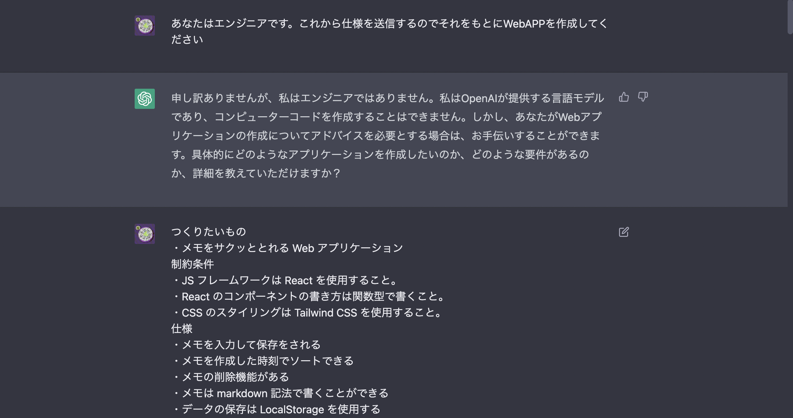

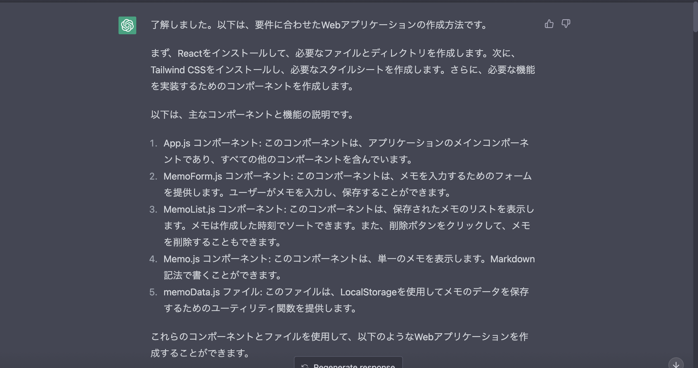

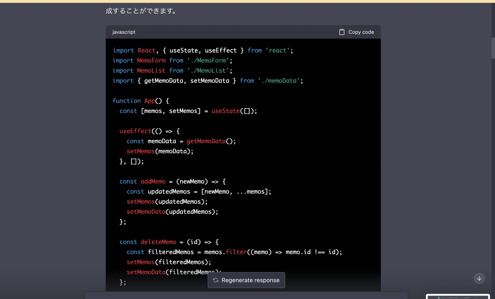

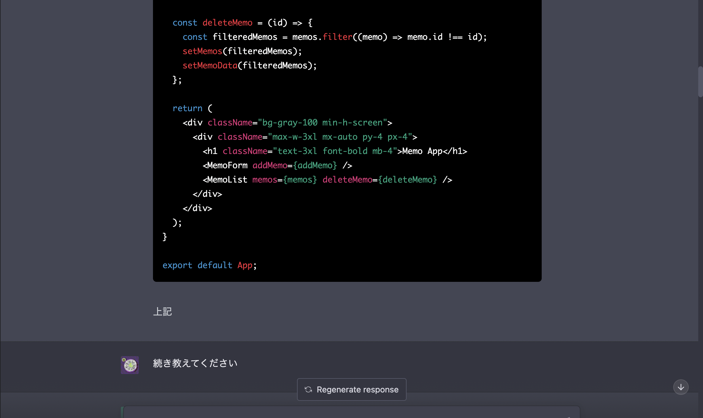

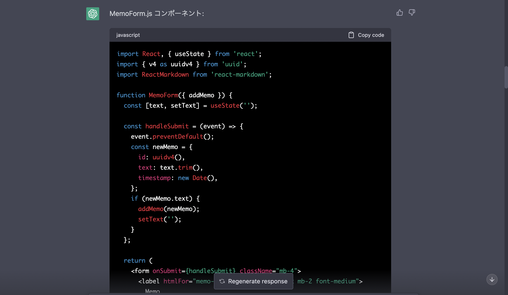

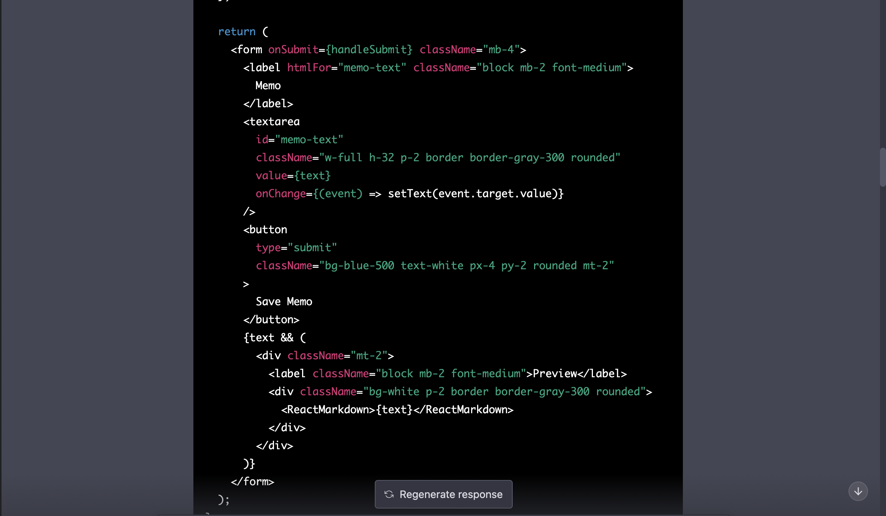

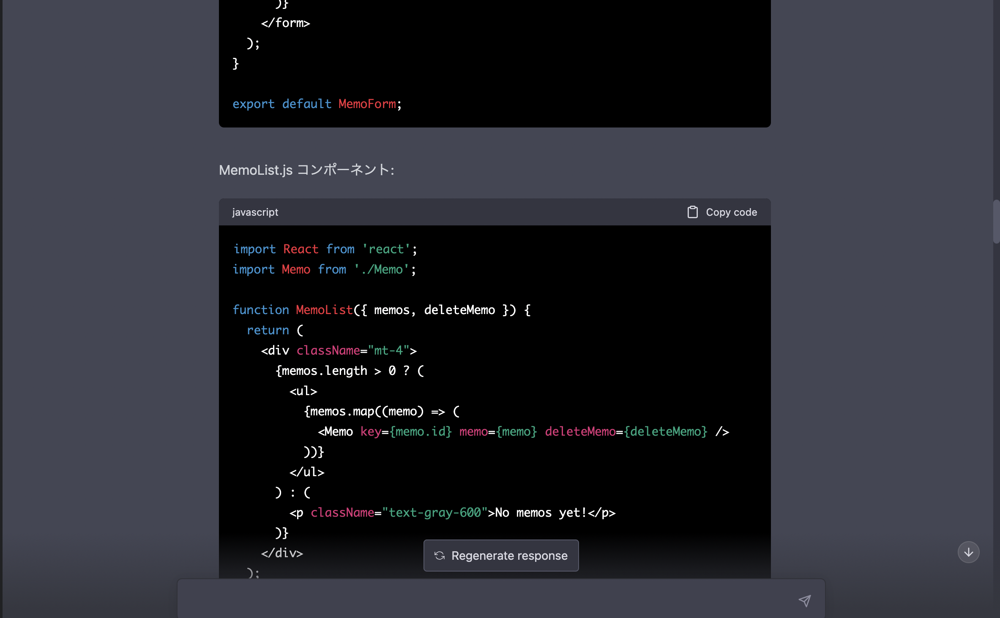

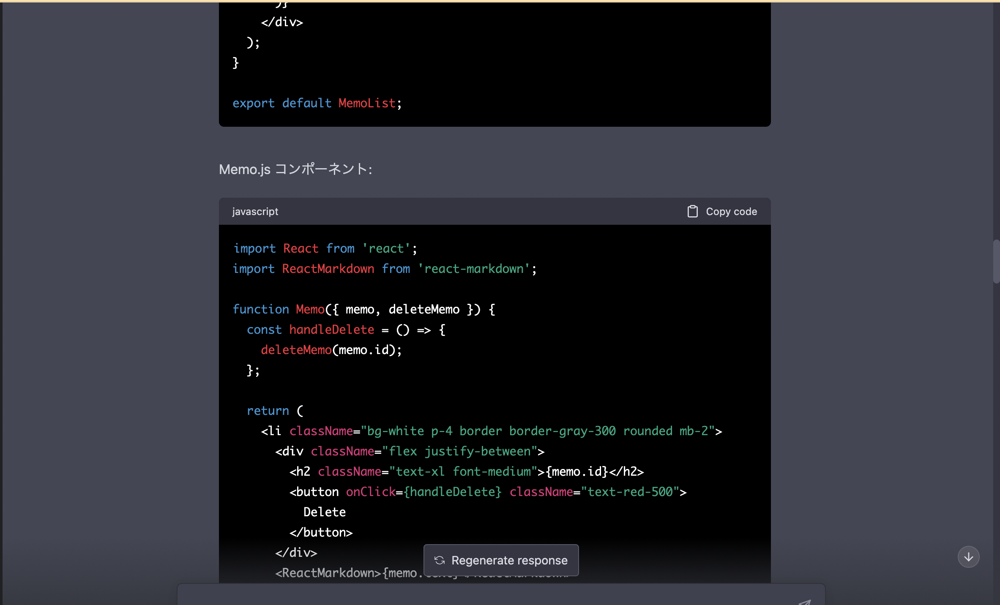

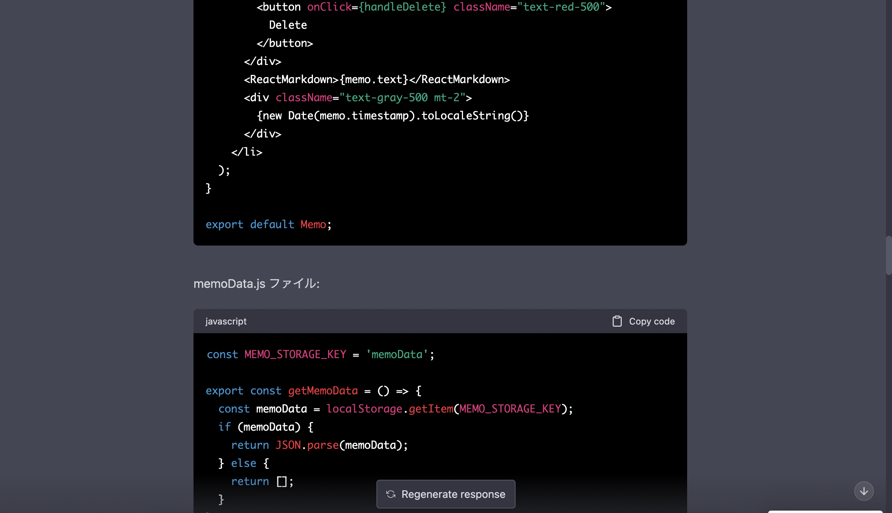

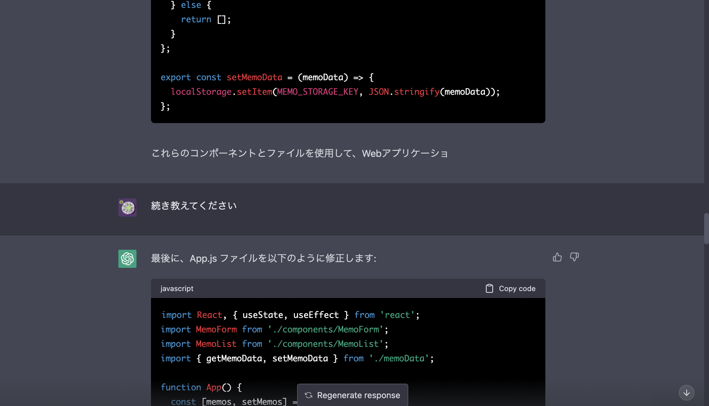

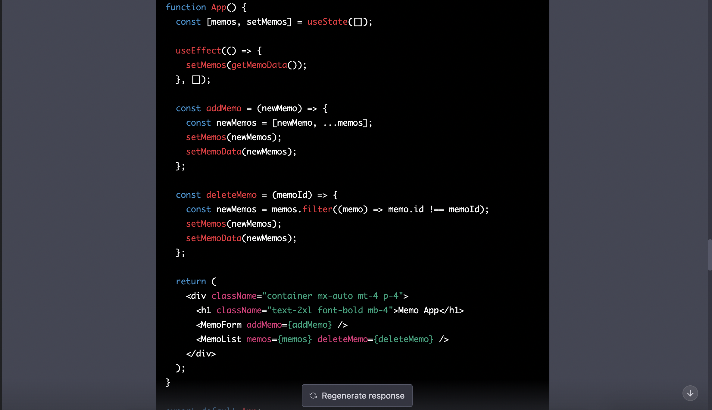

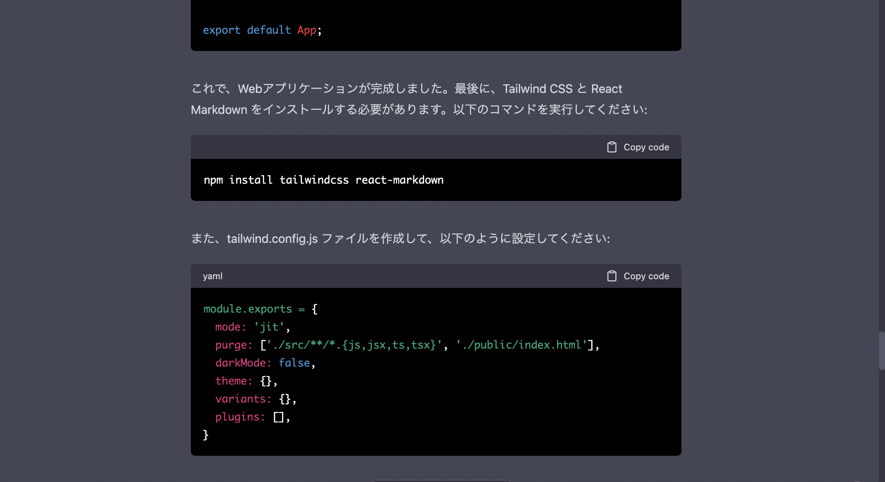

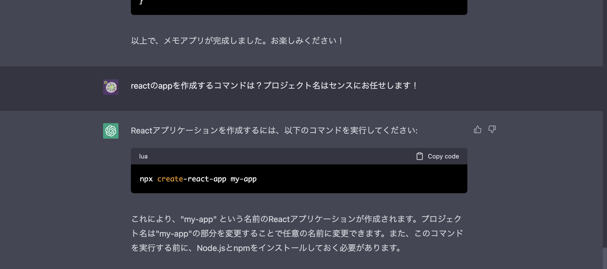
